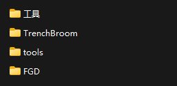
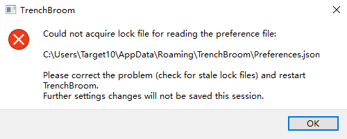
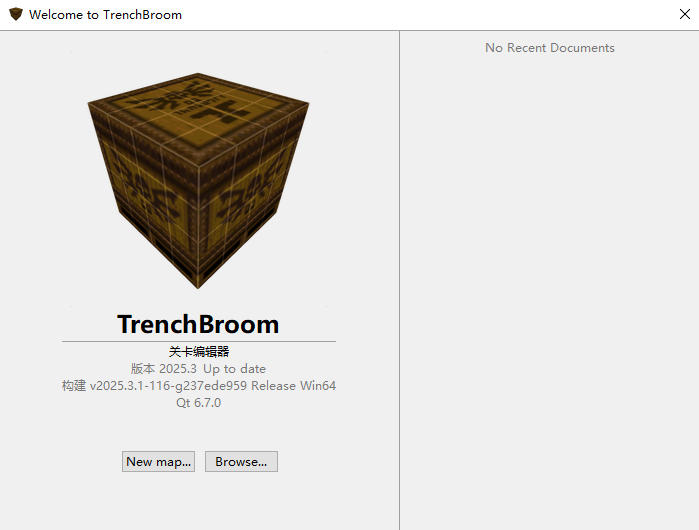
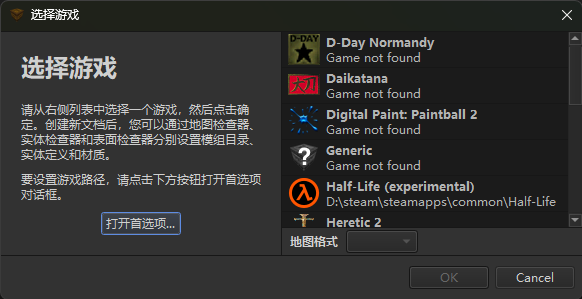
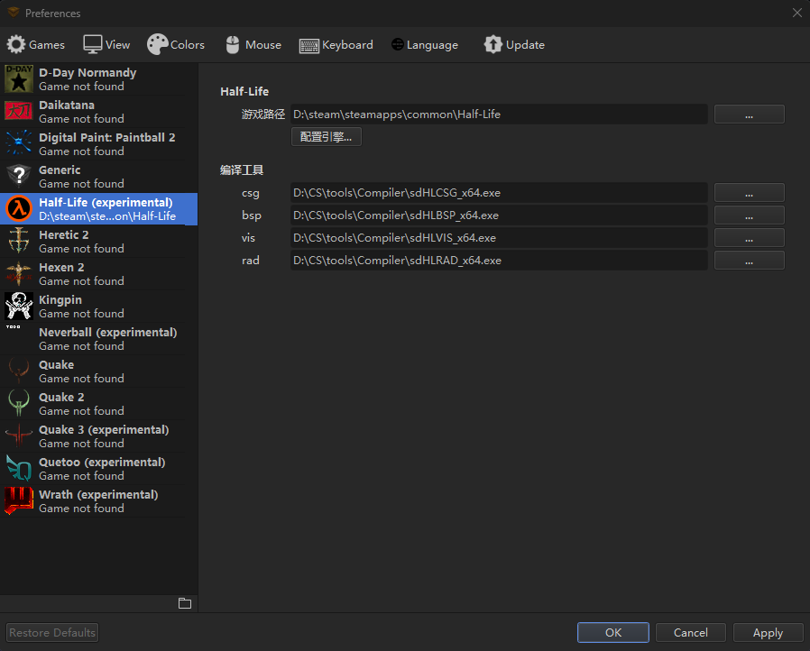
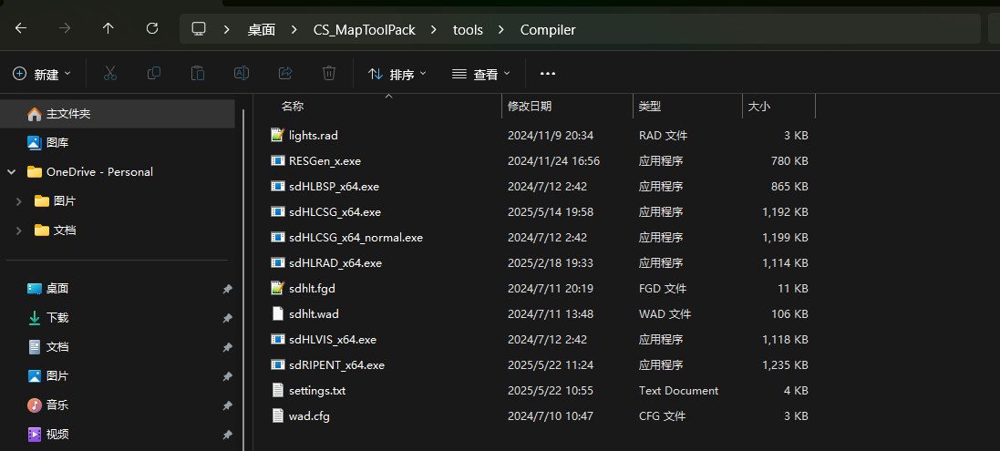
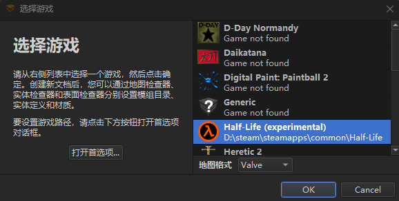
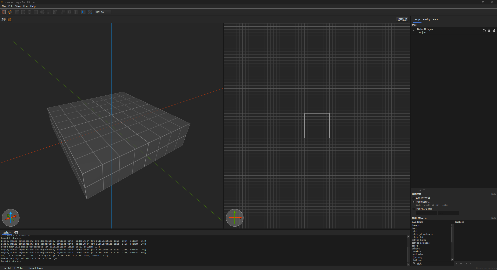

# 工具下载和配置

## 本节中你会了解
- 制作地图需要的基础工具：```Trenchbroom``` （<del>Hammer,JACK</del>)
- **`Trenchbroom`作为一款开源且持续维护的地图编辑器，凭借其优秀的功能和易用性，成为目前最推荐的制图工具**
- 准备工作：如何配置制图工具

## 制图工具
要制作地图，先要有趁手的工具。Trenchbroom（简称TB）是一款强大的开源地图编辑器，最初为Quake游戏开发，但现在已经支持包括CS1.6在内的多种游戏。与传统的Valve Hammer Editor（VHE）相比，Trenchbroom具有更现代化的界面、更丰富的功能和持续的更新维护。它支持多种操作系统（Windows、MacOS、Linux），并提供了许多便捷的编辑功能，如无限撤销/重做、更精确的几何体操作和更灵活的贴图系统。

Trenchbroom的主要优势：
- 开源且持续更新维护
- 跨平台支持（Windows、MacOS、Linux）
- 现代化界面和更高效的工作流程
- 强大的编辑功能和更精准的几何体操作
- 支持多种游戏引擎和格式

你可以从 [Trenchbroom官方GitHub](https://github.com/TrenchBroom/TrenchBroom/releases) 下载最新版本。

不过，为了获得更好的使用体验，我推荐使用针对CS1.6优化编译的TB版本，具体信息请继续阅读下文。

对于习惯使用传统工具的制图者，以下是其他可选工具的信息：

> 旧版教程 Valve Hammer Editor 3.5 [链接](tutorial/legacy/setup)

> Valve Hammer Editor 3.5（VHE）是V社官方为CS1.6地图开发的编辑器，是很多老制图者熟悉的工具。VHE3.5是为CS1.6地图开发的最新版本（再往上的VHE4+是为CSS、CSGO制作地图的，互相不通用）。关于VHE的更多信息，[可以看这里](https://developer.valvesoftware.com/w/index.php?title=Zh/Valve_Hammer_Editor)。

> J.A.C.K.（Jack hammer）是VHE的替代品，他是非官方开发的软件，主要功能和VHE相同，但是提供了很多方便的操作，详情可以看这里[J.A.C.K. :: Official Website (hlfx.ru)](https://jack.hlfx.ru/en/)。

这里提供了一个汉化版的TB版本以及对应的现代化工具包[[下载现代制图工具包]](resources/CS_MapToolPack.7z ':ignore')，它除了基础的TB以外，还打包了其他可能用到的工具，包括：

- **Trenchbroom** ：最重要的制图工具,[Kristian Duske](https://github.com/kduske)主作者,[Lws](https://github.com/Nunite/TrenchBroom)汉化
- **最新fgd**：V大 *cs16_0.8.2.0_vl.fgd*
- **最新编译程序**：[SDHLTx64](https://github.com/seedee/SDHLT)，这是一款基于V大vhlt的改进版编译器，支持更大的地图，模型生成阴影等等...
- **BSP地图查看与编辑工具**：[newbspguy](https://github.com/UnrealKaraulov/newbspguy) - 一款功能强大的BSP工具，支持地图预览、基础编辑功能，以及实体、纹理等地图元素的查看和修改
- **spr、mdl**：*HL Texture Tools*和*Sprite Explorer*、*HLMV*
- **地形制作工具**：方便地制作山体，导出map，*GenSurf*和*Terrain Generator*两款
- **纹理制作工具**：制作自己的wad纹理，*Wally*
- **纹理提取工具**：从bsp里提取打包的纹理，*wintextract*
- **反编译工具**：从bsp反编译得到map源文件，*winbspc*

> **运行库要求**：Windows用户需要安装[适用于Visual Studio 2015、2017、2019和2022的Microsoft Visual C++ Redistributable](https://aka.ms/vs/17/release/vc_redist.x64.exe) (x64版本用于运行64位TrenchBroom)

下载解压后的目录结构是这样的：
> 务必记住你解压的地方，因为你以后需要用到它！
> 不管任何东西都不推荐放在C盘



其中`Trenchbroom`文件夹中的`Trenchbroom.exe`就是主要的制图工具

## 配置Trenchbroom
- 如果是你第一次打开Trenchbroom，你会看到这样的界面

	

- 不要担心，这是正常的，因为这是第一次使用Trenchbroom，需要进行一些配置
- 然后，点击"OK"，会弹出如下窗口

	

	这个界面是主题的主题取决于系统，如果你更喜欢深色主题，后面有设置的方法

> 在初始设置时，你可能会看到自动更新选项。建议关闭此功能，因为自动更新会下载英文版本，而且当前汉化版本已经包含了所有必要的功能和优化。

- 在正式开始做图之前，需要先配置Trenchbroom:
	
- 首先点击`New Map`->`打开首选项`，会弹出如下窗口

	
	

	- 这里我们选择**Half-Life**，因为**CS1.6**是**半条命**的分支，所以选择它
       
根据图片所示，我们继续配置游戏路径和编译工具：

- 选择Half-Life后，我们需要配置以下内容：
  1. **游戏路径**：点击"游戏路径"右侧的"..."按钮，选择你的Half-Life游戏目录（如图片所示：D:\steam\steamapps\common\Half-Life）
  2. **编译工具**：在下方的编译工具部分，需要设置以下几个程序：
     - csg：选择`hlcsg_x64.exe`的路径
     - bsp：选择`hlbsp_x64.exe`的路径
     - vis：选择`hlvis_x64.exe`的路径
     - rad：选择`hlrad_x64.exe`的路径

	

> 注意：这些编译工具都在我们之前下载的工具包的tools/Compiler文件夹中

> CS1.6的FGD我已经在配置文件设置好了，所以不需要再配置。
> 如果你想使用自己的FGD,可以去`TrenchBroom\games\Halflife`配置，本文不做介绍

配置完成后，点击"确定"保存设置。这样我们就完成了游戏路径和编译工具的基本配置，可以开始制作地图了
        
- **点击Half-Life，格式为Valve，再点击OK**

	

- 然后你就会看到这样的界面

	

- **配置wad纹理**：选择“纹理”选项卡，点击“添加”来添加纹理
	- 一般会选择halflife.wad（在CS主目录的valve文件夹里，它包含了半条命1使用的很多纹理）和zhlt.wad（在工具包的tools文件夹里，包含了一些特殊纹理）
	- 
- **配置方案**：切换到游戏参数选项卡
	- 找到“配置方案”选项卡，点击“编辑”，请注意**不要点到**下方打叉的“编辑”按钮。
	- 
	- 在弹出的窗口中点击增加按钮。
	- 
	- 为你的配置方案起个名字。
	- 
	- 你可以给他起一个好区分的名字，例如你想做CS1.6的地图，你可以为这一个配置方案起名CS1.6；又比如你想做半条命的地图，你可以为这一个配置方案起名Half-Life。总之，取什么名字，仅取决于你自己的个人喜好。
	- 完成创建后点击“确定”保存这一方案，回到设置中，选择你先前创建的配置方案。
	- 
	- 这样一来，你接下来所做的配置步骤，将会保存在当前选定的配置方案中。由于在后续配置中我们还要继续使用到配置方案，请务必记住你当前选定的配置方案名字是什么。
	> 对于大多数只想制作CS1.6地图的玩家来说，配置方案并没有什么意义，但当你需要为多个金源引擎的游戏制作地图的时候，由于每个游戏采用不同的“游戏参数”和“编译程序”设定，如果使用单一配置方案，每次都得重新设定所有选项，费时费力，而使用多个配置方案则可以大幅降低工具配置的工作量，你可以通过切换配置方案，快速更改Valve Hammer Editor的“游戏参数”和“编译程序”设定，而无需手动重新配置，为你的地图制作工作节约许多时间，这就是配置方案的意义所在。
- **配置fgd**：切换到“游戏参数”选项卡，点击“添加”，只需添加V大最新的FGD（工具包的fgd文件夹中已经有了）
	- 
- **配置编译程序**：切换到“编译程序”选项卡
	- 选定配置方案。你先前在“游戏参数”中配置时，选定的配置方案是什么，这里的配置方案也就选什么，这就是为什么先前需要你记住创建的配置方案名字。
	- 
	- 设置CSG、BSP、VIS、RAD程序（都在工具包的tools文件夹里，名称分别是hlcsg_x64.exe、hlbsp_x64.exe、hlvis_x64.exe、hlrad_x64.exe）
	- “存放编译好地图的目录”可以填CS的maps文件夹，这样bsp直接放到maps里，不需要手动复制过去
	- “游戏执行程序”就是cstrike.exe的路径，如果勾了编译后自动启动游戏，就会用指定的这个CS程序，也可以不设置
	- 
- 点击下方的“确定”，完成设置
- 到此为止，所有的准备工作已经做完了！下一节里，我们会开始制作第一张地图！
> 一些编译程序并不接受包含中文字符的路径，这可能会导致一张正常的地图无法通过编译。通常的解决方案分两种，第一种方法是将所有包含中文字符的文件夹都改为全英文，但这一做法通常还需要你把配置中的中文路径也一并修改，比较麻烦；另一种方法是使用支持中文字符的编译程序，其中，本教程所提供的编译程序支持中文字符路径，因此，你可以放心使用。