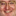

# AAATRIGGER

- 标准版本 

- 旧版本 

**AAATRIGGER**是一种小型但易于识别的[工具纹理](wiki/Tool_Textures/Tool_Textures)，地图制作者用它来帮助识别编辑中的触发刷子实体。它不应该用于常规的世界刷子，因为有时会导致游戏崩溃等问题；所以它必须用于在游戏中不可见的实体，如触发器。

使用AAATRIGGER刷子来标识您的不可见触发器，如[trigger_teleport](https://twhl.info/wiki/page/trigger_teleport)、[trigger_once](https://twhl.info/wiki/page/trigger_once)和[trigger_multiple](https://twhl.info/wiki/page/trigger_multiple)。如果您将它用于[func_button](https://twhl.info/wiki/page/func_button)，那么纹理将被渲染，如上所述，这可能会导致问题。

较新的编译器（如VHLT）会剥离使用AAATRIGGER的面的信息，使其在任何情况下都不可见，使其在视觉上类似于[NULL](wiki/Tool_Textures/NULL)。这作为副作用消除了崩溃问题。即使使用较旧的编译器，按照预期使用AAATRIGGER也比使用普通纹理更为推荐，因为编译器通常将AAATRIGGER纹理的面标记为特殊面，这些面不会消耗任何[AllocBlock](wiki/engine/AllocBlock)资源。

### 趣闻

* 有一个较旧版本的AAATRIGGER，是Gabe Newell面部的低分辨率裁剪，在Half-Life的一些BSP和_xeno.wad_中发现。这里提及是为了澄清关于Half-Life中所谓"怪物盒"中"gaben脸"纹理性质的民间传说。
  * 具体来说，怪物盒是一种古老的Quake技术，用于通过传送门将怪物稍后生成到关卡中，这是因为在地图开发的那个阶段[monstermaker](https://twhl.info/wiki/page/monstermaker)尚未添加到游戏中，或者为了将TriggerTargets绑定到特定怪物，这无法对monstermaker或其子项进行。

[来源：TWHL Wiki](https://twhl.info/wiki/page/AAATRIGGER)