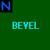

# BEVEL

`BEVEL`工具纹理的行为类似于[NULL](https://twhl.info/wiki/page/NULL)，但它会以一种特殊方式改变刷子的剪裁节点，使得任何接近刷子的玩家在其原点到达`BEVEL`表面所在的平面之前都不会与刷子碰撞。它可用于消除外部角落剪裁错误。对于剪裁节点优化，`BEVEL`相比`NULL`没有优势，有时甚至会比`NULL`使用更多的剪裁节点。

建议使用[CSG](https://twhl.info/wiki/page/CSG_Compiler)的`-cliptype precise`参数代替使用此纹理，但它仍然可以用来修复`-cliptype precise`可能遗漏的任何剩余剪裁错误。

[来源：TWHL Wiki](https://twhl.info/wiki/page/BEVEL)