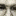

# CLIP

`CLIP` [工具纹理](https://twhl.info/wiki/page/tool_textures)创建一个剪裁平面（隐形墙），作用于所有三个碰撞体积(HULL1-3)，玩家无法穿过但可以射击穿过。

它们可以用来平滑墙壁和地形，防止玩家卡住，或者阻止玩家进入他们不应该去的区域。

使用CLIP刷子的地形

在Counter-Strike中，武器仍然可以穿过剪裁平面掉落。武器和炸弹卡住点的解决方案包括创建一个使用[NULL](https://twhl.info/wiki/page/NULL)纹理的[func_detail](https://twhl.info/wiki/page/func_detail)。由于细节会转换为世界几何体，模型无法在这些刷子内部渲染。你可以将模型的原点移到刷子外部，或者将其转换为[func_wall](https://twhl.info/wiki/page/func_wall)。

## 相关工具纹理

 **`CLIPBEVEL`**

不延伸应用于该面的剪裁平面（效果是使玩家的中心接触到这个面的平面）。

 **`CLIPBEVELBRUSH`**

类似于`CLIPBEVEL`，但应用于剪裁刷子的所有面。

 **`CLIPHULL1`**

为体积#1（站立）创建碰撞。

 **`CLIPHULL2`**

为体积#2（大型怪物）创建碰撞。

 **`CLIPHULL3`**

为体积#3（蹲伏）创建碰撞。

 **`NOCLIP`**

移除应用于刷子的碰撞。类似于实体中的`zhlt_noclip`键值。

## 相关页面

* [HULL #](https://twhl.info/wiki/page/HULL_#)

[来源：TWHL Wiki](https://twhl.info/wiki/page/CLIP)