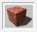
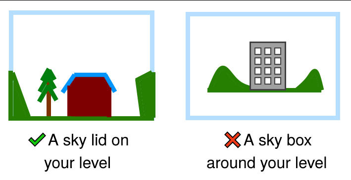

# SKY 纹理

**SKY** 是一种用于放置天空盒的工具纹理。在关卡中，任何应用了此纹理的刷子表面都会被天空盒渲染替代。

关于天空盒的详细信息，请参阅[其专门页面](https://twhl.info/wiki/page/skybox)。

## 使用`SKY`纹理

SKY纹理必须应用于可见的表面，而其余部分可以使用NULL纹理。SKY纹理必须应用于天空刷子的所有表面，否则在较新版本的VHLT的HLRAD.exe中会导致天空光照问题。要做到这一点，选择天空刷子并使用**应用当前纹理**工具，选中`SKY`纹理。

VHLT还会在SKY刷子上自动生成剪裁节点，效果与[CLIP](https://twhl.info/wiki/page/CLIP)刷子相同。可以通过向HLCSG.exe传递参数`-noskyclip`来关闭此功能。原始Half-Life SDK的编译器不会生成这样的剪裁节点，允许玩家在SKY刷子内"游泳"，就像它们是水刷子一样。

### 天气和Counter-Strike: Condition Zero - Deleted Scenes

如果你正在为Counter-Strike: Condition Zero - Deleted Scenes制作地图，并使用任何与天气相关的实体，SKY纹理必须应用于刷子的所有表面。如前所述使用**应用当前纹理**工具。

如果天气实体不工作，这可能是原因所在。

此注意事项**可能**也适用于控制天气的其他游戏/模组。

应用于刷子的Sky纹理在渲染过程中被不同对待。它不像普通纹理那样生成额外的wpoly。一些教程告诉你，将天空纹理用作大型不可见区域的填充物是减少r_speeds的好方法，但我没有证据表明这是减少r_speeds的好方法，因为hint和skip纹理是可用的。然而，减少wpolys的当前最佳实践是在不应该可见的表面上应用[NULL](https://twhl.info/wiki/page/NULL)，例如玩家无法绕过去看到的墙壁背面。

在GL模式下[未在软件模式下测试]，天空盒不会隐藏碰巧在其后面的关卡几何体。解决方案是使用[HINT](https://twhl.info/wiki/page/HINT)刷子进一步优化VIS分割，强制遮挡有问题的区域，或者用几何体或植被覆盖问题区域。

尽管名字如此，你不应该创建一个中空的天空盒然后将你的关卡放在其中。这种所谓的"天空盒"会使BSP膨胀并降低VISibility和wpoly计数方面的性能。

如果你这样做是为了修复[泄漏](https://twhl.info/wiki/page/leak)，请考虑[正确查找并修补这些泄漏](https://twhl.info/wiki/page/Tutorial:_How_to_fix_those_leaks)。

## `SKY`和光照

`SKY`纹理的表面可以通过[light_environment](https://twhl.info/wiki/page/light_environment)或[light_spot](https://twhl.info/wiki/page/light_spot)实体发光。`SKY`发出的光线很特别，因为光线是定向和平行的，不像普通的[纹理光照](https://twhl.info/wiki/page/texture_light)，模拟无限远处的光源（例如太阳）。一个重要注意事项是，方向由俯仰角(Pitch)和偏航角(Yaw)控制，这两个值都需要正确设置以指向_向下_。有关更多信息，请参阅链接页面。

[来源：TWHL Wiki](https://twhl.info/wiki/page/SKY_texture)