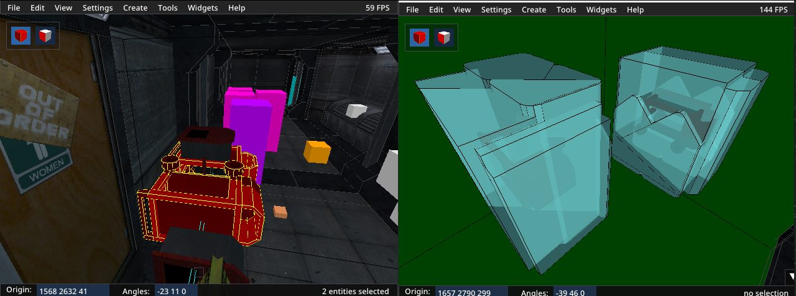

# 目录
- [第一步](#first-step)
- [Clipnodes 削减](#clipnodes-reduction)
  - [删除 Hull 2](#delete-hull-2)
  - [优化](#optimize)
  - [未使用的模型 Hulls](#unused-model-hulls)
  - [简化模型 Hulls](#simplify-model-hulls)
- [其他限制](#other-limits)
  - [Hull 0](#hull-0)
  - [模型](#models)
- [地图脚本设置](#map-script-setup)
  - [特殊目标](#special-targets)
  - [控制台命令](#console-commands)

# 第一步

假设你想将 echoes14.bsp 和 echoes14b.bsp 合并在一起。首先，尝试不带任何特殊选项进行合并。

`bspguy merge test.bsp -maps "echoes14, echoes14b"`

过程结束后，你会看到关于新地图文件的一些统计数据。

```
 Data Type     Current / Max       Fullness
------------  -------------------  --------
models             153 / 4096         3.7%
planes           14831 / 65535       22.6%
vertexes         31226 / 65535       47.6%
nodes            11647 / 32768       35.5%
texinfos          7091 / 32767       21.6%
faces            20846 / 65535       31.8%
clipnodes        33577 / 32767      102.5%  (溢出!!!)
leaves            7537 / 65536       11.5%
marksurfaces     28153 / 65536       43.0%
surfedges        98479 / 512000      19.2%
edges            52964 / 512000      10.3%
textures           272 / 4096         6.6%
lightdata          2.6 / 48.0  MB     5.4%
visdata            2.7 / 8.0   MB    34.0%
entities          1760 / 8192        21.5%
```
在这种情况下，每个地图中的 `clipnode` 数量太多了，它们无法容纳在结果文件中。不过它们*几乎*能容纳下。请阅读下文，看看可以对此做些什么。

# Clipnodes 削减

首先，尝试添加 `-optimize` 选项。如果这还不够，那么再添加 `-nohull2`。如果仍然不够，请参阅 [未使用的模型 Hulls](#unused-model-hulls) 和 [简化模型 Hulls](#simplify-model-hulls) 部分。

如果这些选项*已经*足够，但某些东西的碰撞被破坏了，那么请继续阅读以理解原因。

## 删除 Hull 2
削减 `clipnode` 最简单的方法是在合并时尝试添加 `-nohull2` 选项。

`bspguy merge test.bsp -maps "echoes14, echoes14b" -nohull2`
```
 Data Type     Current / Max       Fullness
------------  -------------------  --------
...
clipnodes        23121 / 32767       70.6%
...
```
问题解决了！但是，对于包含大型怪物或大型 `func_pushable` 的地图，你通常不应使用此选项。如果使用，这些实体的碰撞将不准确。

假设要合并的其中一个地图*确实*有大型怪物，而另一个没有。在这种情况下，你可以在合并前从其中一个地图中剥离 `hull 2`，仍然可以大幅削减 `clipnode`。
```
bspguy noclip echoes14 -hull 2 -o echoes14_nohull2
bspguy merge test.bsp -maps "echoes14_nohull2, echoes14b"
```
```
 Data Type     Current / Max       Fullness
------------  -------------------  --------
...
clipnodes        28473 / 32767       86.9%
...
```
现在假设*两个*地图都有大型怪物。请阅读下一节，看看如何处理这种情况。

## 优化
`-optimize` 标志会有条件地删除那些看起来未被使用的模型 `hull`。例如，一些像 `trigger_once` 这样的不可见实体并不总是需要 `hull 0`（用于渲染和碰撞），而像 `func_illusionary` 这样的实体则不需要任何 `clipnode`。如果地图中没有大型怪物或可推动的物体，`-optimize` 也会删除 `hull 2`。

使用此命令的缺点是，实体状态可能会发生变化，从而导致稍后需要被删除的 `hull`。例如，如果一个 `func_illusionary` 模型被 `trigger_createentity` 用来创建一个 `func_wall`，那么这个 `func_wall` 将没有碰撞，因为 `-optimize` 会删除 `func_illusionary` 模型的所有碰撞 `hull`。同样，如果 `-optimize` 为一个不可见实体删除了 `hull 0`，而该实体后来因脚本或某些实体逻辑而变为可见，游戏也可能会崩溃。

如果使用此选项，你可能还想使用 `-v` 标志来查看哪些模型/实体的 `hull` 被剥离了。这可能有助于调试实体碰撞或崩溃的问题。

## 未使用的模型 Hulls
如果你不能删除所有的 `hull 2`（或者如果这还不够），那么你需要开始从地图中的特定模型中选择性地移除 `clipnode`。3D 编辑器中的 `地图限制` 小部件会告诉你哪些模型值得考虑。点击 `Widgets` -> `Show Limits`。


对于 `worldspawn` 无能为力，但那些 `func_rotating` 实体看起来是很好的候选者。双击它们以将相机聚焦到每一个上。这些是车库区域的天花板风扇。


大型怪物通常无法到达这些风扇，所以让我们删除这些特定风扇模型的 `hull 2`，然后再次尝试合并。用 Ctrl 键选中所有风扇，然后右键点击其中任何一个并选择 `删除 Hull` -> `Hull 2`。


```
bspguy merge test.bsp -maps "echoes14, echoes14b"
```
```
 Data Type     Current / Max       Fullness
------------  -------------------  --------
...
clipnodes        32653 / 32767       99.7%
...
```
勉强通过！

出于好奇，让我们检查一下另一个地图。在编辑器中打开 echoes14b。


这些 `func_train` 实体占用了大量的 `clipnode`！它们不只是你在窗外看到的电影道具吗？


如果你在游戏中检查，你会发现这些实体不仅无法到达，而且它们的碰撞本来就是禁用的。你可以直接穿过那个 `tonk` 和外面所有其他的车辆。另外，为什么那个 `func_illusionary` 会有 `clipnode`？`func_illusionary` 应该是无实体的。

可以肯定地说，我们可以删除那些实体的*所有* `clipnode` `hull`。它们毫无用处！


```
bspguy merge test.bsp -maps "echoes14, echoes14b"
```
```
 Data Type     Current / Max       Fullness
------------  -------------------  --------
...
clipnodes        28615 / 32767       87.3%
...
```
好多了。请注意，`-optimize` 命令会自动删除这些 `hull`，因为它们被标记为非实体，但对于那些有实体且无法到达的东西，需要手动删除 `hull`。

## 简化模型 Hulls
在这种情况下，你发现一个模型占用了大量 `clipnode`，但你不能直接删除它的 `hull`，因为该实体需要碰撞才能正常工作。你现在剩下的最后一个选项是简化该模型的碰撞数据。

以下是 echoes01.bsp 中使用 `clipnode` 最多的模型：


这些 `func_wall_toggle` 实体位于一条走廊中，部分阻挡了路径。



这些实体的 `clipnode` `hull` 不应该被删除，因为玩家可以与它们互动，但这些 `hull` 远比它们需要得复杂。在右边的截图中，我启用了 `视图` -> `Clipnodes` -> `Hull 1`，以将 `clipnode` 可视化为模型周围的彩色外壳。

如你所见，这些 `hull` 基本上就是一个盒子，但带有一些轻微的凸起和圆角。你可以用一个简单的盒子替换这些模型中的碰撞 `hull`，没有人会发现区别。所以，我们就这么做。


简化操作会将 `clipnode hull` 替换为一个轴对齐的包围盒 (axis-aligned bounding box)。这意味着对于倾斜和/或非盒状的物体，这种方法效果不佳。


# 其他限制

你可能遇到的其他限制是 `nodes`、`vertexes` 和 `marksurfaces`。这些都有相同的罪魁祸首——地图中过多的多边形和/或复杂的结构。

## Hull 0

在模型中删除 `hull 0` 可以减少除 `clipnode` 之外的所有类型的数据使用量，但请注意，在以下情况下删除 `hull 0` 会导致游戏崩溃：
- 实体是可见的 = 第一次射击时游戏崩溃
- 实体是固体的 = 站在上面时游戏崩溃

`-optimize` 标志会自动删除那些看起来不需要 `hull 0` 的模型的 `hull 0`，所以请先尝试该选项。如果 `-optimize` 导致不稳定或碰撞问题，请将 `-v` 选项与 `-optimize` 一起使用，以获取所有被删除 `hull` 的模型列表。然后你可以从该列表中的模型中选择性地删除 `hull`。

一个不需要 `hull 0` 的实体例子是 `func_tankcontrols`。这是因为它不可见，并且不与点大小的实体或子弹互动。一个更复杂的例子是 `trigger_once`。虽然它是一个不可见实体，但如果勾选了 "Everything else" 标志，它可以被点大小的实体触发。如果该标志被勾选（或者如果在游戏过程中动态添加了该标志），那么删除 `hull 0` 可能会破坏地图。

如果你知道一个实体可以在没有 `hull 0` 的情况下正常工作，那么选中它并点击 `删除 Hull` -> `Hull 0`。此后，编辑器中显示的 `hull` 将切换到其中一个碰撞 `hull`。


“共享数据”的警告可以忽略，因为我们没有触及任何可能被共享的结构。这个警告只是阻止你在变换小部件中使用某些功能。

## 模型
BSP 模型经常被复制并在地图各处使用（例如 keen halloween 地图中的 picard 硬币）。重复的模型可以被删除，剩下的一个模型可以被多个实体使用。请注意，使用相同模型的实体上，贴花和光照也会被复制，但这对于减少 `vertexes`/`nodes` 等数据来说，可能是一个很小的代价。

使用 `工具` 菜单中的 `模型去重` 选项来移除重复的模型。BSP 数据直到你使用 `清理` 选项后才会被删除。如果你想在不触发玩家的 "Your map differs from the servers"（你的地图与服务器不同）错误的情况下降低模型数量，这会很有用。换句话说，这是一个对 ripent 安全的选项。

# 地图脚本设置
Bspguy 附带了地图脚本，这些脚本是玩未使用 `-noscript` 选项合并的地图所必需的。通过将 bspguy 存档中的 `scripts` 文件夹解压到 `svencoop_addon` 来安装 bspguy 脚本。

当一个地图被合并时，会随合并的地图一起生成一个 `.ent` 文件。这个 `.ent` 文件需要被复制到 `scripts/maps/bspguy/maps/`。脚本使用该文件在新地图区域进入时创建/删除实体。每当实体发生变化时，都需要重新生成此文件。这可以通过 ripent 完成：`ripent -export mapname`

最后，在你合并的地图的 CFG 文件中添加以下行。这会加载地图脚本。
`map_script bspguy/v1/map`

如果你合并的地图已经有自己的地图脚本，那么你需要从该脚本内部调用 bspguy 的 `MapInit`/`MapActivate` 方法。例如，如果你的地图使用了 func_vehicle_custom 脚本，那么编辑后的版本应该如下所示：
```
#include "func_vehicle_custom"
#include "bspguy/v1/bspguy"

void MapInit()
{
	VehicleMapInit( true, true );
	bspguy::MapInit();
}

void MapActivate()
{
	bspguy::MapActivate();
}
```

注意：脚本位于版本化的文件夹中。`v1` 是撰写本文时的最新版本。请使用最新版本。

如果你真的不想使用地图脚本，你可以使用 bspguy 的 `-noscript` 选项。但请注意，如果这样做，实体数量众多的地图可能会很卡。可能还会有更多你需要用 ripent 修复的问题（例如，那些类名被更改为配置性较差的实体）。

一些实体总是会被编辑，以便关卡可以一个接一个地玩（例如 `trigger_changelevel` -> `trigger_once`）。如果你想自己完成所有的 ripent 更改，那么也请添加 `-noripent` 选项。这将合并地图而不触及任何实体逻辑。

## 特殊目标

bspguy 脚本会创建 3 个 `trigger_script` 实体。这些实体控制实体的加载和清理。
- Target: `bspguy_mapchange`
    - 在下一个地图区域加载实体
        - 区域名称从 `!caller` 的一个自定义键值中读取 (`$s_bspguy_next_map`)
    - 在下一个关卡重生所有玩家
    - 删除当前关卡的实体
        - 区域名称从 `!caller` 的一个自定义键值中读取 (`$s_bspguy_map_source`)
- Target: `bspguy_mapload`
    - 在一个地图区域加载实体。
        - 区域名称从 `!caller` 的一个自定义键值中读取 (`$s_bspguy_next_map`)
- Target: `bspguy_mapclean`
    - 在一个地图区域删除实体
        - 区域名称从 `!caller` 的一个自定义键值中读取 (`$s_bspguy_map_source`)

除非你在设置 [[seamless transitions]](无缝过渡)，否则你不需要手动调用这些。如果你将无缝过渡与默认过渡混合使用，那么你可能需要为属于无缝区域的地图手动调用 `bspguy_mapclean`。

如果请求的是相同的地图，对 `mapload`/`mapclean`/`mapchange` 的重复调用会被忽略。

## 控制台命令

在控制台中输入 `bspguy` 以获取调试命令。

要快速测试每个地图区域，请使用 `bspguy mapchange` 命令。除了跳过区域，这个命令还可以重新启动当前区域或返回到之前的区域。