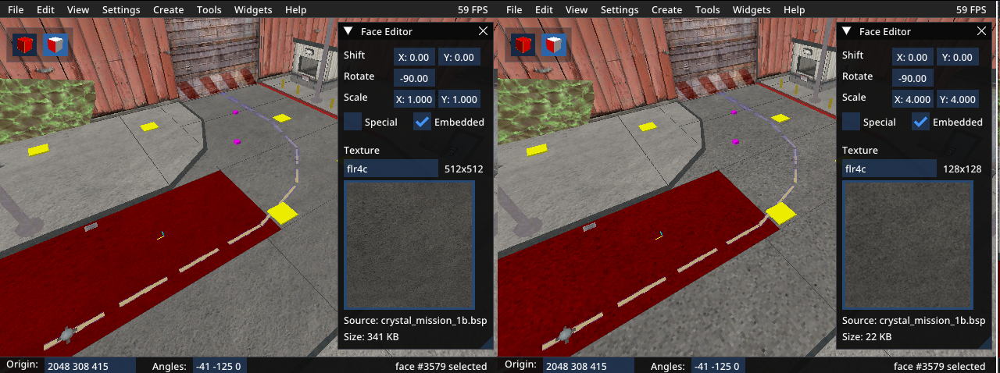

# 简介

Sven Co-op 引擎是一个经过轻微修改的 GoldSrc 引擎。最大的区别在于其拥有更高的限制，理论上允许创建更大、更精细的地图。然而在实践中，地图制作者仍然会首先遇到 `clipnodes` 的限制，而这个限制并没有改变。大多数 SC 5.x 版本的地图并没有真正需要更高限制的特性。在这种情况下，你可以使用 bspguy 运行几个命令，让这些地图在 Half-Life 中运行。

本指南将介绍在 Half-Life 中尝试运行现代 Sven Co-op 地图时会遇到的问题，以及解决这些问题的工具。其中一些工具也可用于地图编辑和合并。

# 目录
- [纹理过大](#textures-too-big)
- [错误的表面范围 (Bad Surface Extents)](#bad-surface-extents)
  - [细分面](#subdivide-faces)
  - [缩减纹理](#downscale-textures)
  - [缩放所有面](#scale-all-faces)
  - [选择性地缩放面](#selectively-scale-faces)
- [AllocBlock 已满](#allocblock-full)
  - [缩减纹理](#downscaling-textures)
  - [缩放不可见面](#scale-invisible-faces)
- [模型过多](#too-many-models)
  - [模型去重](#deduplicate-models)
  - [合并模型 (进行中)](#merge-models-wip)
- [地图过大](#map-too-big)
  - [移动 Worldspawn](#move-worldspawn)
  - [拆分与合并 (基础)](#split-and-merge-basic)
  - [拆分与合并 (高级)](#split-and-merge-advanced)
  - [更新你的 Mod](#update-your-mod)
- [损坏的梯子](#broken-ladders)
- [损坏的光照贴图](#broken-lightmaps)
  - [纹理光源](#texture-lights)
  - [RAD 设置](#rad-settings)
- [示例工作流程](#example-workflow)

# 纹理过大

此问题适用于游戏中的所有视觉资源：地图、模型、`sprites` 和天空盒。在 Sven Co-op 中，纹理的最大分辨率为 `1048576` 像素，对于方形纹理即 `1024x1024`。而在 Half-Life 中，最大分辨率为 `262144` 像素，或方形纹理的 `512x512`。

如果超出纹理大小限制，Half-Life 客户端会崩溃且不显示任何错误信息。幸运的是，没有其他与移植相关的问题会导致这种情况。因此，当你遇到无报错崩溃时，可以确定是某个纹理过大所致。最常见的情况是 MDL 文件。你可以尝试删除所有实体并加载地图，以单独测试地图纹理。

要调整无效地图纹理的大小，请选择 `工具` -> `纹理` -> `缩减无效纹理`。这会将任何过大的纹理缩小到下一个 2 的幂次的大小。如果大纹理存储在 WAD 文件中，它会先被嵌入到 BSP 文件中，然后再进行缩减。

对于一个地图系列，你可能希望直接编辑 WAD 文件，但首先需要在 bspguy 中进行缩减以调整纹理坐标。在 WAD 中缩减纹理后，你可以稍后将其取消嵌入。

# 错误的表面范围 (Bad Surface Extents)

Surface Extents 定义了一个面的 `lightmap` 区域。在 Sven Co-op 中，每个 `lightmap` 最大可达 `64x64` 像素。而在 Half-Life 中，仅为 `16x16` 像素。这就是为什么当你为一个 Sven Co-op 地图选择了错误的引擎时，地图的光照会损坏。编辑器是基于一个更小的最大尺寸来显示 `lightmap` 的。

错误的表面范围无法通过自动化工具盲目修复。你需要在纹理质量和多边形数量之间取得平衡。修复无效面后，你还需要通过 RAD 编译器运行地图，为 Half-Life 生成有效的 `lightmap`。

请参阅下文的解决方案。

## 细分面

解决此问题最简单的方法是使用 `工具` -> `修复错误范围` -> `细分` 来细分每个无效面。这会立即修复所有错误的面，但代价巨大。多边形数量会比以前高得多，BSP 数据量也会急剧增加。游戏内性能会变差甚至接近无法游玩，并且你可能会超出某个引擎限制。

这就是我尝试在 crystal_mission_1b 中细分所有错误面后发生的情况。我现在已经达到了 `vertexes` 限制的 142%，而且地图看起来像是被扔进了搅拌机。是时候点击 `撤销` 并尝试其他方法了。你并不总能明显地发现自己超出了限制。请密切关注“地图限制”选项卡。

这是一个适合使用自动细分工具的例子。

左边是原始地图。右边是我细分了无效面之后。你可以看到多边形数量明显增多，但在这个区域总共也只有大约 100 个。这不算什么。没人会因此感到卡顿。如果游戏中的 `wpoly` 数量超过 1000，我才会开始担心。要在 Half-Life 中查看 `wpoly` 数量，请在控制台中输入 `developer 1` 和 `r_speeds 1`。

## 缩减纹理

这个工具可能无法修复所有错误的面，但它可以修复绝大多数。我通常会先用这个方法，然后再有选择地进行缩减和细分。

在这个例子中，我正在处理 crystal_mission_1b。我点击了 `验证`，看到有 4484 个面的表面范围错误。这个数量太大了。我不想手动处理所有这些。让我们看看纹理大小。Sven 地图制作者经常使用高清纹理，在我看来，这让游戏看起来更糟，也更不像 Half-Life 了。

以这个纹理为例。它基本上是染成灰色的随机噪声。真的需要一个高清纹理来传达这个信息吗？比较一下左右两张图。我把它缩减到了右边的 256x256。你能注意到区别吗？即使并排看也很难分辨。

让我们再进一步。128x128。

直到现在它才开始显得有些格格不入，因为它旁边是一个类似的 512x512 的碎石纹理。不过，这更符合 Half-Life 纹理的样子。

有很多这样的高清纹理，我认为可以在不明显降低质量的情况下进行缩减。但是，要注意包含文本的纹理：

256x256 的缩减使这个标志无法辨认。我将不得不在 con3_1 中手动缩减大纹理，以避免破坏这一个纹理。

以下是在 crystal_mission_1b 上使用各种自动缩减选项后，“错误表面范围”面的数量：
- 不缩减：`4494`
- 缩减至 256x256：`3658`
- 缩减至 128x128：`2128`
- 缩减至 64x64：`1366`

这些方法都不能完全解决问题，但 128x128 和 64x64 大大减少了问题。一旦数量降到 1000 个面左右，再进行细分就安全得多了。对于这样的大型地图，你几乎不会注意到多边形数量的增加。如果错误的面集中在单个区域，那么你需要进行一些手动缩减以降低 `wpoly`。

总结一下，缩减纹理直到错误面的数量变得可控，然后细分其余部分。如果任何一个区域的 `wpoly` 数量过高，就撤销细分并缩减更多纹理。努力在纹理质量和多边形数量之间找到平衡，倾向于低多边形数量的一边。“这个地图让我卡顿”是比“这些纹理看起来很糟糕”严重得多的问题。

## 缩放所有面

这是一个“一键修复”的懒人方案，但通常会毁掉地图。选择 `工具` -> `修复错误范围` -> `缩放`。所有无效面的纹理都会被放大。与细分不同，这不会增加多边形数量，也不会导致溢出。这种方法的缺点是纹理错位和表面质量下降。例如：

窗户被移位到消失，栅栏则被钢筋重建。在像道路这样的物体上放大纹理是合理的，因为它即使移位了看起来也差不多。除此之外，这是一个糟糕的结果。

## 选择性地缩放面

这是一个你可能希望缩放一个面，而不是细分它或缩减纹理的例子 (sc_arctic_escape)：

我将雪地和岩石纹理的缩放比例从 1.0 调整到了 2.2。通过这样做，我将无效面的数量从 `596` 减少到了 `143`。其他面我可能会进行细分，这会在地图的不同区域轻微增加多边形数量。

在这种情况下，它看起来并不糟糕，因为地图非常简单，地形纹理的位置并不重要。我甚至认为它看起来更好，因为平铺效果不那么明显，而且较低的细节更好地匹配了地图几何体的低细节。如果你想保持纹理的位置和大致外观不变，那么你应该选择缩减纹理。

记住那个缩放比例：`2.2`。这是一个可以修复任何表面范围错误面的神奇数字。将当前的缩放比例乘以 2.2，你就可以修复这个面。原因在于 Sven Co-op 的编译器会细分大于 528 的面，这恰好是 Half-Life 默认值 240 的 2.2 倍。

# AllocBlock 已满

AllocBlock 是用于存储 `lightmap` 的内存块。由于 GoldSrc 的 `lightmap` 生成代码是私有的，所以它不容易计算。你可以在“地图限制”小部件中大致了解使用了多少空间。有时你会看到它溢出但实际上没问题，或者在游戏中出现错误时它却没有显示溢出。我不知道 Valve 是如何实现他们的 `lightmap` 图集的。

“AllocBlock Full”是一个 Sven Co-op 通过将限制提高 16 倍解决的错误（其他东西会先溢出）。在 Half-Life 中，这几乎和 `clipnodes` 一样烦人。解决方案与修复错误表面范围的面相同。你需要缩放面或缩减纹理来减小 `lightmap` 的大小。

## 缩减纹理

转到“地图限制”小部件中的 AllocBlock 选项卡，查看哪些纹理消耗了最多的 AllocBlocks。在这个例子中，我正在查看 sc_castlevania：

双击一个纹理名称，将相机聚焦到使用它的一个面上。

今天我运气不错。第一个纹理正是我认为对于 Half-Life 来说过于高清的。第二个是那种在任何尺寸下看起来都差不多的随机噪声纹理。缩减这些为我节省了大约 14 个 AllocBlock。

如果缩减选项是灰色的，请在“面编辑器”小部件中勾选“已嵌入”复选框。只有嵌入的纹理才能被缩减。

## 缩放不可见面

选择 `工具` -> `缩放不可见面`。这会放大像 `trigger_once` 这样的实体上的纹理，这些实体有时尽管不可见，却仍会占用 `lightmap` 空间（因为没有使用 `aaatrigger` 纹理）。通常这类实体不多，所以它减少的 AllocBlocks 也很少，但这是一个一键修复且没有缺点的方法。

# 模型过多

Half-Life 中的最大模型数量是 512。这个限制由 BSP 模型、MDL 文件和 SPR 文件共享。在 Sven Co-op 中，这个限制是 8192。在这个限制被提高之前，地图制作者经常需要合并相似的 BSP 模型以控制模型数量。有了 Sven Co-op 引擎，你就可以做出像这样的东西：

每个扶手和柱子都是一个独立的 `func_wall` 实体。像这样的细节将地图的模型数量提高到了 1065。对于 Half-Life，你希望将其降到最多 400 左右，以便为预缓存 MDL 和 SPR 文件留出空间。

## 模型去重

第一步很简单，并且通常能独立解决问题。选择 `工具` -> `模型去重`。这会扫描看起来完全相同的 BSP 模型，并更新地图实体，使其只使用一组重复模型中的一个。这有效地降低了模型数量，并允许预缓存更多的游戏 MDL 和 SPR 文件。

如果地图中有超过 512 个 BSP 模型（包括不再被引用的），运行 `工具` -> `删除 BSP 数据` -> `清理` 来删除未使用的 BSP 模型。否则游戏在解析 BSP 时会崩溃。这不会自动完成，以防你只想进行一次仅 ripent 的编辑（不需要玩家删除他们版本的地图）。

使用这个命令有一个缺点。共享同一个模型的实体将拥有相同的光照和贴花。射击其中一个会在所有这些实体上同时产生弹孔。没有独立的 `lightmap`，一些实体可能会显得过亮或过暗。这里有一个例子 (sc_darknebula)：

右图是我进行模型去重后的效果。这个发光的白板在地图其他地方的一个更亮的房间里被用作实体。现在它与那个实体共享同一个模型，所以它看起来太亮了。为了防止这种情况发生，可以在执行 `模型去重` 之前 `剪切` 该实体，然后在之后 `粘贴到原始位置`。这样可以防止该模型被考虑用于去重。

## 合并模型 (进行中)

去重并不总是足够。在 crystal_mission_1b 中，有很多 `func_wall` 实体共享一个小区域，但它们彼此不是重复的。在这种情况下，应该合并这些模型以形成一个更大的模型。

以 sc_propanic 为例。这是一个在限制提高之前设计的巨大地图。

这些 `func_illusionary` 实体都被绑定在一起，以避免超出模型限制。对于较新的 Sven Co-op 地图，必须这样做才能让它们在 Half-Life 中运行。

...

糟糕。我还没有制作合并模型的工具。那个可能要等到 v6 版本了。

# 地图过大

Sven Co-op 已将最大世界尺寸从 +/-4096 增加到了 +/-32768。技术上讲，新尺寸是 +/-131072，但游戏在那个距离上会出问题。如果不是因为 `clipnode` 限制，这会是最难解决的问题。地图制作者倾向于不断建造，直到编译器告诉他们停下来。除非地图设计得非常简单，否则 `clipnode` 限制会远在 +/-32k 网格被填满之前就溢出。

以下是将 Sven Co-op 地图适配到 Half-Life 较小限制内的解决方案。

## 移动 Worldspawn
在很多情况下，我看到的是这样的情况。一个地图是使用升级后的限制建造的，但它完全可以放进一个 +/-4096 的盒子内。只是它的放置方式导致它无法在 HL 中直接运行。修复方法很简单：
1.  选择 `worldspawn`。
2.  通过 `视图` -> `地图边界` 启用世界边界渲染。
3.  打开变换小部件。
4.  移动 `worldspawn` 直到它完全位于绿色盒子内。
5.  点击 `应用 BSP 移动`。

点击 `应用 BSP 移动` 非常重要。当 `worldspawn` 实体的原点不是零向量时，会发生糟糕的事情。

## 拆分与合并 (基础)
在这种情况下，地图比一个 +/-4096 的盒子能容纳的要大，但它是由几个通过传送门连接的封闭区域组成的。地图制作者很少填满地图网格的垂直空间，所以你通常可以拆分并堆叠这些不相连的区域，以使其适应这个立方体。例如：

这个地图 (mogul) 完全超出了边界。我试过把它移到绿色立方体内，但它离完全容纳还差得远。

好消息是，这个地图中的单个区域可以独立地放进立方体内，并且它们全部加起来使用的垂直空间不超过 8192 单位。以下是如何拆分和合并地图以使其适配的方法。

### 将每个区域隔离到其自己的 BSP 文件中

对每个封闭区域执行以下步骤：
1.  将其移动到绿色盒子内。
2.  使用 `工具` -> `删除 BSP 数据` -> `OOB __ 轴` 来删除其他区域。
3.  `文件` -> `另存为副本...` 并选择一个独特的文件名。
4.  `文件` -> `重新加载` 以恢复原始地图。
5.  对其他区域重复此操作。

### 将隔离的区域合并回一起

使用命令行界面 (CLI) 合并多个地图是最快的。你也可以使用 `文件` -> `合并` 选项，但它一次只能合并 2 个地图（截至 v5 版本），并且可能打包得不够紧凑。

我将 mogul 的 4 个区域分别命名为 `a.bsp`、`b.bsp`、`c.bsp` 和 `d.bsp`。我用来合并它们的命令是：  
`bspguy merge mogul_hl -maps "a,b,c,d" -hl -noscript -noripent`

`-hl` 是为了适应 `+/-4096` 的较小世界尺寸而添加的。`-noscript -noripent` 是因为我不想让 bspguy 将这些 BSP 视为独立的地图并尝试调整实体逻辑。它只是同一个地图被拆分成了几块。结果如下：

完美适配。

## 拆分与合并 (高级)

这与处理不相连区域的过程相同，只是你需要分割大的区域并通过传送门重新连接它们。

以 bts_rc 为例。该地图使用的垂直空间不多，所以如果拆分和合并，它可以放进立方体内。然而，其主要区域本身就太大了。需要找到一个好的分割点，以便放置一个相对传送门。

这看起来是一个不错的分割点。它是一条靠近地图中点的走廊，将主要区域一分为二。看起来那里也没有太多活动。如果运气好，玩家甚至不会注意到他们被传送了。

以下是使用 `工具` -> `删除 BSP 数据` -> `OOB __ 轴` 隔离后每一边的样子：

不应该在走廊的正中间分割，因为那样在接近传送门（尚未放置）时你会看到虚空。你也想保留拐角周围的一些面。有一些重复的浮动部分应该用 `剔除框` 工具移除，但这能让你大致了解情况。

从这里开始，过程与上一节相同。合并地图后，放置一个相对传送门来连接这两半。[点击这里](https://github.com/wootguy/bspguy/wiki/Seamless-transitions-in-merged-maps)查看教程。

## 更新你的 Mod

一些地图的区域过大，无法在没有重大缺点的情况下进行分割。看看 snd.bsp

我绝不会尝试分割这个。它使用的垂直空间不多，但地图是一个巨大的区域，没有明显的分割点。我将不得不制作跨越整个 +/-4096 世界边界的相对传送门。技术上可行，但在游戏中看到会是一种突兀的效果。阿帕奇直升机和步兵会频繁地出现和消失。一个更好的选择是更新你的 Mod 来支持这样的大型地图。

在 Half-Life Mod 中支持更大的地图并不困难，但这是一项大工程，并且需要一个自定义的客户端。在 `delta.lst` 中增加了原点坐标的限制后，你需要将所有默认的 NetworkMessage 效果替换为可以使用更大世界坐标值的自定义效果（例如 `SVC_SOUND` 和 `SVC_TEMPENTITY`）。

# 损坏的梯子

如果一个 `func_ladder` 附加了一个非零的原点，那你就要倒霉了。假设你接触时没有立即崩溃，你会被以超光速向后弹射，并可能因坠落伤害而死亡。

修复很简单。复制梯子的 BSP 模型，并使用变换小部件将其 `Origin` 移动到 `0 0 0`（将 `目标` 设置为 `Origin`）。这也可以通过 `工具` -> `实体原点归零` 来完成。该工具会自动将有问题的实体（`func_ladder`、`func_water`、`func_mortarfield`）的原点归零。

这个问题通常只在合并的 Sven Co-op 地图（我的错）中发生。梯子通常不会附加 Origin 画刷，除非它们离地图原点非常远。在这种情况下，一个 Origin 画刷可以防止[可怕的预测问题](https://www.youtube.com/watch?v=5dT3V-R-l3E)。

# 损坏的光照贴图

`Lightmaps` 每当你缩放面、细分面或缩减纹理时都会损坏。要修复 `lightmaps`，你需要通过 RAD 编译器运行地图以重新生成它们。这个过程通常很简单，只需将 `hlrad.exe` 和 `lights.rad` 复制到与地图相同的文件夹中，然后运行以下命令：

`hlrad.exe -estimate -nobleedfix -notextures -bounce 3 -extra mapname.bsp`

- `-nobleedfix` 修复如果面被细分后出现的块状光照
- `-notextures` 允许你在不寻找所有 WAD 并将它们移动到同一文件夹的情况下重新编译。如果重新编译后的光照看起来有显著差异，请移除此项。

这两个选项都是 vluzacn 的编译工具 ([VHLT](https://developer.valvesoftware.com/wiki/VHLT)) 所独有的。Sven Co-op 的编译器 ([SCHLT](https://developer.valvesoftware.com/wiki/SCHLT)) 是基于 VHLT 的。

其他选项使光照看起来更平滑、更自然（`-bounce 3` 和 `-extra`）。你可能想用 `-fast` 而不是 `-extra` 来进行测试编译。

## 纹理光源

你的 `lights.rad` 文件需要与地图制作者使用的相匹配。如果不匹配，光照会看起来不正确，和/或一些区域会漆黑一片。在大多数情况下，使用的是 Hammer 自带的默认文件。这是一个使用自定义 `lights.rad` 条目的地图 (bmsl)：

当使用默认的 `lights.rad` 重新编译时，这个通风口会变得漆黑一片。要修复它：

1.  禁用 `视图` -> `纹理`，以便你能看到 `lightmap` 的颜色。
2.  找到发光的纹理（本例中为 `~spotred`）。
3.  截一张图，在 paint.net 或类似工具中使用取色器工具获取光的 RGB 值。

这束光的颜色是 `208 0 0`。在 `lights.rad` 中添加以下行：  
`~spotred    208 0 0 1000`  
亮度值 `1000` 只是一个猜测。增加或减少零，直到亮度与原始地图匹配。

## RAD 设置

仅仅有一个准确的 `lights.rad` 文件有时还不够。有时你还需要重新配置 RAD。这里有一个例子 (con3_3)：

这里没有光源实体，所以这一定是一个纹理光源。禁用 `视图` -> `纹理` 来查看 `lightmap` 的颜色：

嗯？这白光是怎么把墙壁染成橙色的？

答案是 `Texture Reflection`。这是 VHLT 中一个相对较新的功能。地图中的纹理会影响从它们身上反弹的光线。在这种情况下，熔岩纹理主要是橙色的。来自同一纹理的白光反射到自身，产生了橙色的色调。

要在重新编译时获得同样的效果，请从命令中移除 `-nowadtextures`，并将所有需要的 WAD 复制到同一文件夹中。纹理反射在 VHLT 中默认启用，但不能与 `-nowadtextures` 一起使用。如果你忘记了某个 WAD，程序会报错。如果发生这种情况，删除 `mapname.err` 文件再试一次。

还有许多其他 RAD 设置会影响光的颜色和亮度。根据我的经验，默认设置通常能让你足够接近原始光照，但你可能想进行一些实验。我曾在自己的地图中使用 `-minlight` 和 `-ambient` 来照亮黑暗区域。我也认识一个地图制作者使用 `-bounce 1` 来获得更锐利的光照。`-scale` 和 `-gamma` 可以用来改变地图的整体亮度。其他设置我认为不会经常被触及。

# 示例工作流程

现在你已经深入了解了如何解决所有这些问题。以下是我遵循的一个工作流程，用于移植一个包含所有可能问题的地图。

1.  如果地图不适合 +/-4k 的盒子，[移动世界](#move-worldspawn)或[拆分+合并](#split-and-merge-basic)。
2.  `工具` -> `纹理` -> `缩减无效纹理`
3.  `工具` -> `缩放不可见面`
4.  `工具` -> `实体原点归零`
5.  `工具` -> `模型去重`
6.  `工具` -> `修复错误范围` -> `缩减 256x256`
7.  `工具` -> `修复错误范围` -> `细分`
8.  `hlrad.exe -estimate -nobleedfix -notextures -bounce 3 -extra mapname.bsp`
9.  测试

这个过程最有可能在细分步骤失败。`wpoly` 可能过高，或者某个限制可能溢出。在这种情况下，我会撤销细分，并有选择地进行缩放/缩减，然后重试。

我使用[其他程序](https://github.com/wootguy/SevenKewp/blob/master/scripts/convert_map.py)来转换无效的 MDL、SPR、TGA 和音频文件。