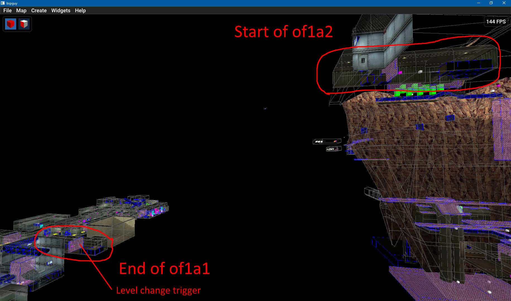
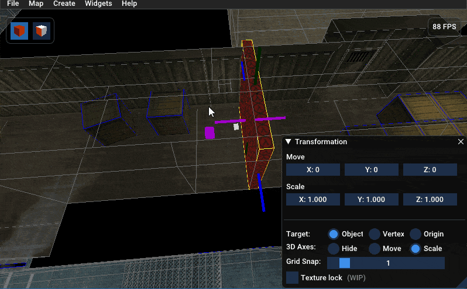
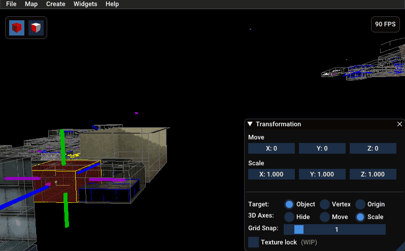
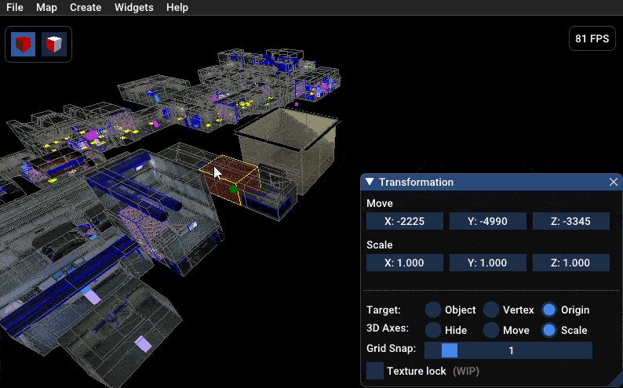
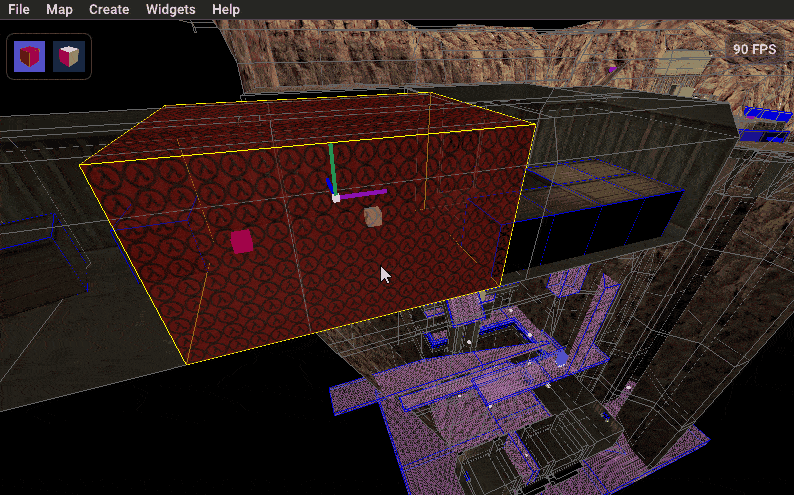
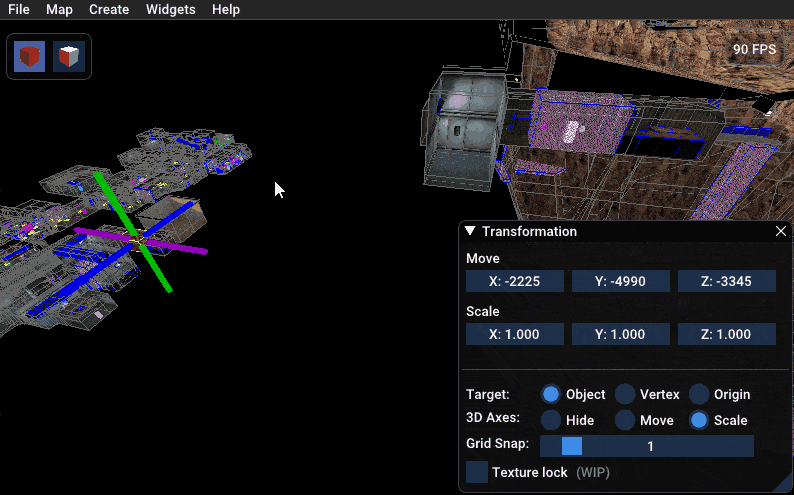

# 目录
- [简介](#intro)
- [实现无缝过渡](#make-a-transition-seamless)
  - [找到现有的关卡过渡点](#find-the-existing-level-transition)
  - [对齐每个区域中的 entity 原点](#align-entity-origins-in-each-section)
  - [创建传送门](#create-the-teleports)
  - [微调](#fine-tuning)
- [视频指南](#Video-guide)

# 简介

默认情况下，当到达一个新区域时，合并后的地图过渡会 `respawn` 所有玩家。这能保持 `entity` 逻辑的简单性，但对于正在进行解谜或战斗的玩家来说可能会很突兀。无缝过渡则能制造出地图各区域物理连接成一个大地图的假象，让玩家可以按照自己的节奏进入新区域。

无缝过渡是通过 `relative teleports` 实现的。这类传送门会将玩家移动到新区域，其位置相对于他们接触传送 `trigger` 的位置。这意味着，如果你在走廊的左侧接触 `trigger`，你最终会出现在下一关卡中该走廊的左侧（假设两个地图都有相同的走廊）。在完美的情况下，你甚至不会注意到自己被传送了。

并非所有地图都能或都应该进行无缝过渡。Sven 系列中的许多地图会将你 `spawn` 在完全不同的区域，这使得 `relative teleports` 的设置更为复杂，也更容易导致玩家卡在墙壁或物体里。一个地图系列也可能因为 `entity` 过多，而无法在使用 `relative teleports` 时保持良好性能。例如 `saving_the_second_amendment` 地图中有如此多的怪物，如果你尝试设置一个带传送门的合并版本，地图会因 `lag` 而无法游玩。如果你注意到性能问题，那么就坚持使用默认的关卡过渡，或者只在怪物/`entity` 较少的区域之间使用 `relative teleports`。

# 实现无缝过渡
在这个例子中，我将合并 `of1a1` 和 `of1a2`。这些地图是实现无缝过渡的理想选择，因为每个地图在关卡过渡发生的地方都有一条完全相同的走廊。这些地图中的怪物/`entity` 不多，所以我也不担心 `lag` 问题。我使用以下命令合并了地图，并在 3D 查看器中打开了合并后的地图。
`bspguy merge test -maps "of1a1, of1a2"`

## 找到现有的关卡过渡点
第一步是找到关卡过渡点的位置。通常在地图的末端会有一个 `trigger_once`，它会触发 `bspguy_mapchange`，但这并非绝对。

在地图的 `of1a1` 部分，我找到了 `trigger_once`，所以我打算将其改造为一个传送门。如果你没有现成的关卡过渡 `entity` 可用，你可以从顶部菜单栏创建一个新的固体 `entity`（`Create` -> `BSP Model`）。我希望使用现有的 `entity`，因为它的尺寸已经适合这条走廊。

## 对齐每个区域中的 entity 原点
这部分可能会有些棘手，具体取决于两个地图之间共享的区域。你需要找到一个角落或某个可以用来对齐 `entity` 的东西。目标是在两个地图中标记出相同的位置。对齐需要靠肉眼观察，但网格吸附功能可以使这个过程更容易。

在 `trigger` 周围有一些箱子，所以我会缩放 `brush` 让它接触到这些箱子。这些箱子也将作为我在下一个地图中的参考点。要缩放模型：
1) 打开 `Transformation widget`（按 `Ctrl+M`，或右键点击 `entity` 并选择 `Transform`）
2) 将 `3D Axes` 设置为 `Scale`
3) 拖动彩色条来调整模型大小

`Relative teleports` 使用 `trigger` 的原点来计算传送位置。我们可以将模型的原点保留在现在的位置，但如果我们将原点移动到模型的中心，会更容易看清情况。要做到这一点：
1) 在 `Transformation widget` 中将 `Target` 设置为 `Origin`
2) 寻找刚刚出现的绿色立方体。许多模型的原点在坐标 [0,0,0] 处，所以它可能离你现在看的地方很远。
3) 右键点击立方体并选择 `Center`。现在原点应该在 `trigger` 的中心了。
4) (可选) 再次右键点击立方体并选择 `Align` -> `Bottom`。我喜欢将传送门原点放在地面上。

创建这个 `entity` 的一个副本，并将其移动到下一个地图中完全相同的位置。要做到这一点：
1) 复制 `entity`（`Ctrl+C` 或右键点击 `entity` 并选择 `Copy`）
2) 粘贴 `entity`（`Ctrl+V` 或在*地图内*的空白处右键点击并选择 `Paste`）
3) 抓取复制的 `entity` 并将其移动到下一个地图的起点（按 `G` 或右键点击 `entity` 并选择 `Grab`）。
4) 当 `entity` 大致在你想要的位置时，取消抓取（再次按 `G` 或右键 -> `Ungrab`）。
5) 在 `Transformation widget` 中，将 `Target` 设置为 `Object`，并将 `3D Axes` 设置为 `Move`
6) 使用彩色条或数字输入微调 `trigger` 的位置，使其在完全相同的点接触到箱子。

## 创建传送门

我们现在有两个在两个地图中对齐方式完全相同的固体 `entity`。它们稍后会变成 `trigger_teleport` `ents`，但首先让我们创建传送目的地。它们的位置必须与传送门的原点相匹配。
1) `Copy` 该 `entity`
2) `Paste at original origin`
3) 打开 `keyvalue editor`（`Alt+Enter` 或右键点击 `entity` 并选择 `Properties`）
4) 切换到 `Raw Edit` 选项卡并删除 `model` 键。这将固体 `entity` 转换为点 `entity`。
5) 将 `class` 更改为 `info_teleport_destination`（点击顶部的 `class` 按钮或手动编辑键值）。
6) 对另一个地图中的 `trigger` 重复步骤 1-5。

现在是时候更新 `keyvalues`，使这些传送门生效了。

首先，将 `triggers` 转换为 `relative teleports`，并将它们链接到各自的目的地：
1) 将两个 `triggers` 的 `class` 都更改为 `trigger_teleport`
2) 在 `Keyvalue Editor` 中切换到 `Flags` 选项卡，并为两个 `triggers` 启用以下标志：
    - `Relative Teleport`
    - `Keep Angles`
    - `Keep Velocity`
3) 切换到 `Attributes` 选项卡，并将两个 `teleport triggers` 的 `Name` 设置为 `bspguy_nodelete`。这可以防止 bspguy 地图脚本删除这些 `entity`（任何以 `bspguy` 为前缀的名称都可以）。
4) 将 `of1a1` 中的 `info_teleport_destination` 的 `Name` 设置为类似 `bspguy_tele_of1a1` 的名字。
5) 将 `of1a2` 中的 `info_teleport_destination` 的 `Name` 设置为类似 `bspguy_tele_of1a2` 的名字（`bspguy` 前缀是强制性的）。
6) 将 `of1a1` 中的 `trigger_teleport` 的 `Target` 设置为 `bspguy_tele_of1a2`（或你使用的任何名称）。
7) 将 `of1a2` 中的 `trigger_teleport` 的 `Target` 设置为 `bspguy_tele_of1a1`（或你使用的任何名称）。
8) 将每个 `trigger_teleport` 和 `info_teleport_destination` 的 `Teleport Cooldown Delay` 设置为 `0.01`，以便多个玩家可以同时传送。

接下来，添加一个 `trigger` 来告诉 bspguy 地图脚本加载下一关卡的 `entity`。没有这个，当你进入 `of1a2` 区域时，它将是空的。
1) 选择 `of1a2` 中的 `info_teleport_destination`。
2) 将其 `Target` 设置为 `bspguy_mapload`。
3) 在 `Flags` 选项卡中，启用 `Trigger on arrival`。
4) 在 `Raw Edit` 选项卡中，添加一个名为 `$s_next_map` 的新 `keyvalue`，其值为 `of1a2`。这告诉 bspguy 地图脚本要加载哪个地图区域。

`keyvalue` 编辑的部分就到这里。

接下来，我们需要调整 `trigger_teleport` `brushes`，使它们不会重叠在同一区域。否则，你在传送到 `of1a2` 后会立即传送回 `of1a1`。**在执行此操作之前，请复制 `trigger` 模型，以便你可以单独编辑每个 `trigger`**（右键点击 `entity` -> `Duplicate BSP model`）。

从你跑向下一个/上一个区域的走廊的视角来看，`trigger_teleport` `ents` 应该放置在 `info_teleport_destination` `ents` *之后*。在中间留出一些空间，这样玩家就不会同时接触到两个 `triggers`。使用 `info_teleport_destination` `entities` 作为参考（它们的大小与玩家相同）。

在 `Target` 设置为 `Object` 且 `3D Axes` 设置为 `Move` 时，小心不要移动 `brushes`。这会移动 `triggers` 的原点，从而破坏无缝过渡。如果你不小心这样做了，可以复制/粘贴 `info_teleport_destination` `entities` 的原点来重新对齐 `trigger_teleport` `entities`。

`Scale` 模型（`Target` = `Object` 且 `3D Axes` = `Scale`）或编辑模型顶点（`Target` = `Vertex` 且 `3D Axes` = `Move`）来移动 `brushes`。这些操作不会影响模型的原点。

测试一下吧！如果运气好，你可能已经完成了。

## 微调

到此为止，传送门应该可以正常工作了。在我的例子中，如果我在过渡期间接触到其中一面墙，我会被卡住。如果走廊的尺寸略有不同，或者仅仅是由于碰撞系统的不精确性，都可能发生这种情况。假设走廊大小相同，你可以通过轻微移动 `info_teleport_destination` `entities` 来修复这个卡墙问题。在 `Transform widget` 中，将 `Grid snap` 设置为 `0`，这样你就可以以单位的一小部分来移动 `entities`。我通过将传送目的地从墙边移开 0.2 个单位修复了卡顿问题。小心不要移动得太多，否则你只会被卡在对面的墙里。

你可能会注意到新区域的光照有些变化。如果两个区域中的面大小相同，你可以将 `lightmaps` 从第一个地图复制到第二个。但该功能尚在 `WIP` 中，所以如果你这样做，效果很可能会更糟。在实验前请备份地图。目前还没有撤销按钮！

最后，记得在地图的 `CFG` 文件中添加 `mp_telefrag 0`，否则玩家在传送到别人身上时会被 `gibbed`。

# 视频指南

如果你看我操作一遍，可能会更容易理解。

注意：请忽略视频中我勾选 "Fire on Enter" `flags` 的部分。我曾以为那能让传送门没有冷却时间，但实际上并不能。正确的做法是，为每个 `trigger_teleport` 和 `info_teleport_destination` `entity` 将 `Teleport Cooldown Delay` 设置为 0.01。