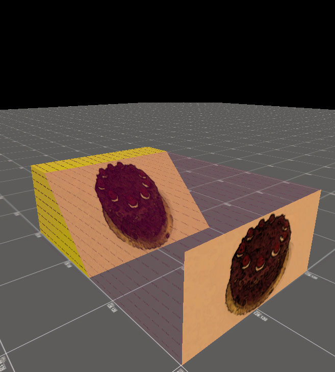
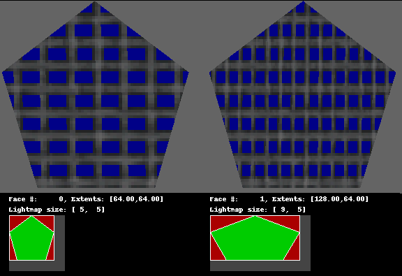

# AllocBlock

**AllocBlock** (分配块)是GoldSrc引擎内部用于为每个面绘制光照的一种纹理图集。纹理图集是一个(或多个)包含较小的单独纹理(在这种情况下是光照纹理或luxels)的纹理表，它映射到一个或多个面(对于allocblocks总是1:1)。

由于光照数据[lightmaps](https://twhl.info/wiki/page/lightmap)的密度低于纹理数据，但反过来对每个面都是唯一的，引擎将它们合并到一个128x128光照像素(luxels)的纹理表中，一次最多可以有64个[注1]。这意味着地图上的纹理细节总量有一个硬性限制，而纹理缩放会影响总量。

分配过程发生在地图加载时，对于合格的面[注2]，无论是否存在光照图数据(未点亮的纯黑面不消耗光照数据)。

光照图的分配大小计算如下：
1. 从面的顶点开始，通过将顶点投影到与纹理相同的平面上来计算其范围，继承纹理的比例，然后取适合这些顶点的矩形范围。
2. 将范围除以16(引擎固定的值)并四舍五入以扩大面积(对最小值向下取整，对最大值向上取整)。
3. 对于最右边和最底部的luxels行，每边增加1个luxel。

然后，每个面的分配过程可以概括如下：
1. 在一个块上，在未分配区域中找到能够容纳面的光照图大小的最高(最接近顶部)矩形
2. 如果存在这样的区域，则分配矩形，并靠左对齐
3. 如果没有适合的区域，尝试下一个块并重复该过程(最多64次)

由于面的范围是矩形的，所以产生的光照图也是矩形的。逻辑上讲，这意味着当面有对角边时会产生一些浪费。对角线切成两个三角形的矩形(即◩)使用了完整矩形两倍的AllocBlock。然而，最大的浪费发生在细长的对角面上。

覆盖在面范围(矩形,红色)上。被标红的区域被浪费了。")

分配算法也不是很高效。较大的面往往比需要的多浪费一小部分分配区域，因为它埋没了本可以容纳一些较小面的角落和缝隙。目前还没有工具可以重新排序BSP中的面，以填补这些空隙。

上标红的区域被浪费了。")

虽然AllocBlocks纯粹是引擎内部的构造，但其影响显著，以至于像VHLT这样的现代编译工具会模拟将面分配到AllocBlocks，以测量引擎加载时地图会使用的AllocBlocks数量。

## 注释

1. Svengine(Sven Co-Op的引擎)已经增加了这个限制。
2. 用户发布的图像aaatrigger、用户发布的图像sky、`!`-前缀的液体纹理以及标记为特殊的面都被豁免，因此如果有的话会显示为全亮。

## AllocBlock:Full

令人恐惧的AllocBlock:Full错误发生在引擎用完这64个AllocBlocks，但还有面剩余时。简单地说，这是因为地图中的纹理像素太多。这可能是意外发生的，比如在缩小笔刷时锁定比例，或者变换笔刷导致纹理垂直于面，在这种情况下你应该去修复它。当意外的小比例面被消除但AllocBlocks仍然超出预算时，应该开始对纹理比例进行预算，通过增加某些面的比例来减少总纹素(和相应的luxels)数量。还应该优化笔刷工作以减少切割对角边，如前所述，这会浪费分配空间。
